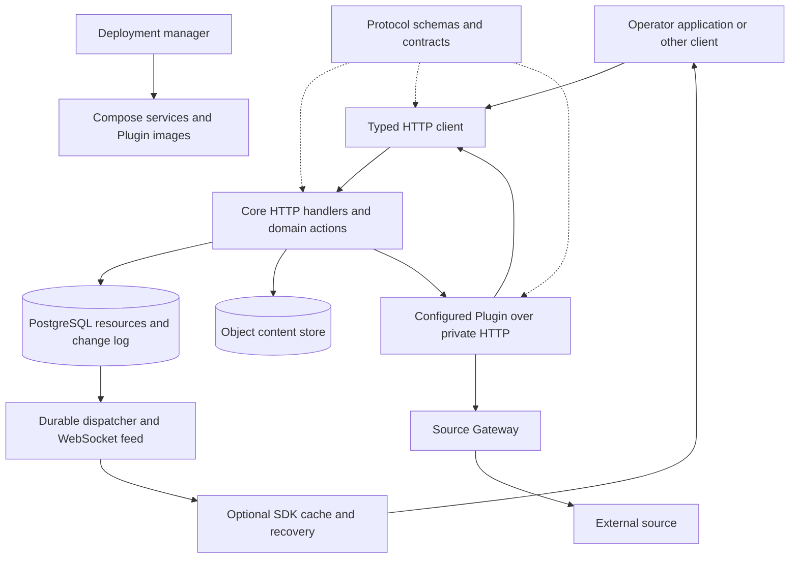

# Atlas Modernization system map

Current lifecycle contract: [ADR-0015](../../adr/0015-separate-start-stop-restart-and-reset.md) supersedes wipe-on-start. Start, Stop and Restart retain operational data and logs; Reset clears them while keeping setup and installed artifacts. Core stays running throughout field missions; Restart and Reset are primarily development actions outside missions. Mission execution continuity across Core restart is outside scope. Updates to a new Core release perform Reset; operational-data migrations are excluded. Backup and restore functionality is excluded. Source observations below describe the inspected historical implementation; successor recommendations remain provisional unless backed by an accepted decision.

Successor decision update: [Core owns Commands and Assets execute Tasks](../../adr/0004-core-owns-commands-and-assets-execute-tasks.md). Plugins expose Operations, process data or ingest external sources; they cannot introduce Asset Commands or be taskable Tool Assets. [Planned stops and updates protect active Plugin work](../../adr/0006-protect-active-plugin-work-during-lifecycle-changes.md). Source descriptions below remain historical evidence; conflicting research proposals are superseded.

Scope update: the user needs removable mission-specific extensions in separate repositories alongside permanent Core modules. See [temporary mission extensions](11-mission-extensions.md). Earlier proposals to absorb integrations apply to permanent capabilities; the old extension-management machinery remains open for simplification.

Research date: 2026-09-20
Research timestamp: 2026-09-20T15:35:31-04:00

Research baseline: source commit `8edee4e2743fbf0f85c16dfe638d9222141cf279`. This describes the inspected source, not an approved architecture for the successor.

## What Atlas actually does

Atlas keeps an operational picture of Entities, stores Object metadata and content, and coordinates Tasks assigned to Assets. Protocol defines the shared vocabulary and wire contracts. Core owns durable state and Task lifecycle rules. The SDK gives clients typed access and optionally maintains a synchronized local view. Plugins supply external capabilities through Core.

The old repository also contains an operator web application, a simulation workbench, and Meshtastic Link. Those are useful consumers and compatibility examples. Their full implementations do not automatically belong in this extraction. The `edge/asset` and `edge/gateway` directories in this revision are role documents, not shipped applications. Untracked legacy directories in the user's original working folder were excluded.

Evidence: [repository map](https://github.com/the-Drunken-coder/Atlas-Modernization/blob/8edee4e2743fbf0f85c16dfe638d9222141cf279/README.md#repository-map), [source glossary](https://github.com/the-Drunken-coder/Atlas-Modernization/blob/8edee4e2743fbf0f85c16dfe638d9222141cf279/CONTEXT.md), [Core composition and routes](https://github.com/the-Drunken-coder/Atlas-Modernization/blob/8edee4e2743fbf0f85c16dfe638d9222141cf279/services/core/cmd/atlas_core/main.go#L146-L304).

The diagram shows logical responsibilities. The SDK library can be instantiated inside a Plugin or another client. The Source Gateway is a separate process built from the Core Go module. Neither is a separate authority over Atlas resources.

## Five flows worth preserving as a working specification

### 1. Report an Entity change

An authenticated request reaches a handler, passes request and Protocol validation, and calls the action layer. A versioned mutation takes the global change-clock lock, mutates the resource, and records its event in the same database transaction. Rollback removes the mutation, event, and counter increment together. The feed dispatcher reads committed event rows; PostgreSQL notifications only wake it.

That is a useful guarantee. It does not require a message broker, and the durable change log is not a claim that Atlas uses event sourcing. Resource tables remain authoritative current state. The serialized write path has a throughput tradeoff that must be measured against an actual workload.

Evidence: [write-version transaction](https://github.com/the-Drunken-coder/Atlas-Modernization/blob/8edee4e2743fbf0f85c16dfe638d9222141cf279/services/core/internal/actions/write_version.go#L12-L54), [transactional event recording](https://github.com/the-Drunken-coder/Atlas-Modernization/blob/8edee4e2743fbf0f85c16dfe638d9222141cf279/services/core/internal/actions/change_hook.go#L181-L201), [durable dispatcher](https://github.com/the-Drunken-coder/Atlas-Modernization/blob/8edee4e2743fbf0f85c16dfe638d9222141cf279/services/core/internal/feed/dispatcher.go#L68-L129).

### 2. Reconnect a client without losing changes

SDK startup hydrates a full dataset while retaining the initial watermark. It then recovers changes from that watermark. Reconnection establishes subscriptions and waits for their acknowledgement, buffers live events, drains durable recovery, and applies later buffered events in order. Per-resource versions and delete markers prevent stale responses from bringing deleted data back. An expired cursor triggers full hydration.

These steps explain much of the SDK's complexity. A replacement client must either preserve them or deliberately offer a weaker, explicit contract. Swapping WebSocket for SSE does not remove races between snapshot, subscription, and replay. A query UI that tolerates refresh and invalidation may need much less machinery than a complete local replica.

Evidence: [feed consumption contract](https://github.com/the-Drunken-coder/Atlas-Modernization/blob/8edee4e2743fbf0f85c16dfe638d9222141cf279/docs/atlas-change-feed/README.md#L37-L65), [SDK behavior](https://github.com/the-Drunken-coder/Atlas-Modernization/blob/8edee4e2743fbf0f85c16dfe638d9222141cf279/docs/atlas-sdk/README.md).

### 3. Deliver and execute a Task

Core accepts a Command from the Protocol catalog and checks it against the Asset's registered manifest. The Task has one immutable Asset assignment. Core coordinates delivery and lifecycle; the Asset executes the work. Runtime registration, readiness, and generation fencing distinguish the current process from a replaced process. A check-in reports observed state and does not deliver Tasks.

There is an important limit to the old system as a specification. The production Command catalog at this SHA is `[]`, and its authoring directory contains only a README. Task tests use fixture Commands. This is an intentional documented state, not a newly reproduced defect. It proves substantial machinery exists, but not that its policy fits the first real Asset.

Before importing all scheduling and safety rules, choose a real Command and prove creation, delivery, restart, cancellation, completion, and durable output with its actual implementation. A timeout or lost connection must not silently turn into a claim of physical completion.

Evidence: [Task ownership and rules](https://github.com/the-Drunken-coder/Atlas-Modernization/blob/8edee4e2743fbf0f85c16dfe638d9222141cf279/docs/atlas-protocol/commands-and-tasking.md#L37-L55), [generated production catalog](https://github.com/the-Drunken-coder/Atlas-Modernization/blob/8edee4e2743fbf0f85c16dfe638d9222141cf279/packages/protocol/generated/command_catalog.json#L1), [Command authoring](https://github.com/the-Drunken-coder/Atlas-Modernization/blob/8edee4e2743fbf0f85c16dfe638d9222141cf279/packages/protocol/commands/README.md), [check-in implementation](https://github.com/the-Drunken-coder/Atlas-Modernization/blob/8edee4e2743fbf0f85c16dfe638d9222141cf279/services/core/internal/actions/entity_checkin_actions.go#L36-L49).

### 4. Store and delete Object content

An Object's metadata lives in PostgreSQL and its content lives outside the database. Upload intents, deletion fences, and cleanup retries exist because the two stores cannot share a database transaction. The source backup procedure captures a consistent pair; Atlas Core excludes backup and restore functionality. Replacing MinIO with another S3 server leaves that coordination problem in place. Even local files require consistent publication and honest handling of interrupted writes.

This is the strongest reason to test the actual Object requirements early. Small bounded content may justify database storage. Large media may justify a separate content store despite the operational work. Decide from size, throughput, retained-state startup and Reset requirements rather than familiarity with a vendor.

Evidence: [Object upload coordination](https://github.com/the-Drunken-coder/Atlas-Modernization/blob/8edee4e2743fbf0f85c16dfe638d9222141cf279/services/core/internal/actions/object_upload.go#L195), [durable storage decision](https://github.com/the-Drunken-coder/Atlas-Modernization/blob/8edee4e2743fbf0f85c16dfe638d9222141cf279/docs/design-decisions/2026-05-29-schema-evolution-without-migrations.md). Detailed alternatives belong in [storage](02-storage.md).

### 5. Invoke and update a Plugin

Core discovers a configured Plugin over private HTTP and exposes bounded, side-effect-free Operations through public Atlas endpoints. Plugins can use the SDK to access Atlas and a private Source Gateway to access External sources without directly receiving source credentials. These Plugins are trusted, not tenant-isolated extensions. Core does not treat Plugin health failure as Core failure.

The existing manager verifies and installs separately versioned Plugin releases from a signed first-party catalog. Independent release cadence is real, not future work. Managed independent lifecycle currently supports query-only Plugins; taskable Plugins have additional policy that remains deferred. Datastream delivery and persistence are also explicitly deferred.

Evidence: [Plugin contract and deferred capabilities](https://github.com/the-Drunken-coder/Atlas-Modernization/blob/8edee4e2743fbf0f85c16dfe638d9222141cf279/docs/atlas-plugins/README.md), [independent releases decision](https://github.com/the-Drunken-coder/Atlas-Modernization/blob/8edee4e2743fbf0f85c16dfe638d9222141cf279/docs/design-decisions/2026-09-01-plugins-release-independently-from-atlas-core.md).

## Extraction scope and feature disposition

These are recommendations to review, not authorized removals. The user subsequently confirmed that breaking changes are allowed, the first deployment is one server with field clients, and Plugins themselves are open to removal or absorption into internal modules. See [system options](08-system-options.md).

| Capability | Evidence in the source | Proposed treatment |
| --- | --- | --- |
| Entity identity and Asset, Track, Geofeature distinctions | Protocol, Core CRUD, consumers | Preserve vocabulary; choose the first concrete fields from real workflows |
| Core as authority over shared state | Transactional actions and resource tables | Keep |
| Explicit Task lifecycle and runtime fencing | Core actions and fixture acceptance tests | Keep needed invariants; prove one production Command before copying all policy |
| Immediate versus queued scheduling, fixed start window, safety interlocks | Protocol tasking contract | Reopen with the first real Asset; do not replace policy by guesses |
| Operator attribution for Task creation/cancellation | Explicitly omitted in tasking contract | Reopen before committing a new durable schema |
| Movement history, observation time, received time, trail | Dedicated history tables and routes | Keep if historical tracking is in the first product; avoid copying it as generic event sourcing |
| Object metadata and historical references | Core resource actions | Keep if Object workflows remain |
| Object content and paired backup | Separate storage and recovery code | Prototype storage choices before adopting the deployment machinery |
| Full-dataset SDK replica | SDK sync engine | Optional advanced capability; compare with query plus invalidation |
| Typed HTTP client and runtime validation | SDK and Protocol | Keep, with narrower packaging |
| Global recovery cursor and bounded replay | Change log and feed | Baseline for replica clients; evaluate each field client separately and preserve required mutation/event atomicity |
| Operator sessions and machine keys | Core auth module | Keep one explicit trust model; revisit scopes if third parties are needed |
| Plugin Operations | Both example Plugins | Keep if extensible queries are part of the product |
| Tool Assets and taskable Plugins | Runtime support, documented lifecycle constraints | Excluded from the successor: Plugins are not Task targets; use Operations or managed processing/ingestion |
| Source Gateway | Separate process in Core module | Reevaluate credential ownership and process placement |
| Signed catalog, rollback journal, independent release | CLI and release workflows | Reopen the need for independent installation along with Plugins; preserve integrity if retained |
| Datastreams | Named but delivery contract deferred | Do not extract an imagined implementation |
| Existing map UI and simulation workbench | Separate surfaces and consumer packages | Use as behavior examples; port only selected features later |
| Meshtastic Link and radio firmware integration | Separate communication package | Keep outside first Core extraction unless field transport is explicitly selected |
| Cloudflare Tunnel and Pages | Optional ingress and separate UI hosting | Deployment adapters, not Core requirements |
| General plugin marketplace, multi-tenancy, HA clusters | Not established by this baseline | Do not add without a product requirement |

## Where the implementation weight sits

The inventory counted physical lines in `.go`, `.ts`, `.tsx`, `.js`, and `.mjs` files. Test directories and conventional test filenames are classified as tests; files under `generated` are classified separately. Remaining files include scripts and fixtures, so these are navigation measurements, not a quality score or production bundle size.

| Scope | Other source lines | Test lines | Generated lines |
| --- | ---: | ---: | ---: |
| Core | 17,755 | 24,553 | 0 |
| Protocol | 4,452 | 3,276 | 2,830 |
| SDK | 4,996 | 11,391 | 0 |
| Plugin runtime | 677 | 1,248 | 0 |
| Core CLI | 19,742 | 18,627 | 0 |
| Reference Plugin | 94 | 14 | 0 |
| Building Scan Plugin | 428 | 281 | 0 |

The deployment CLI contains more measured non-test source than the Core service. That is a reason to scrutinize the supported deployment and recovery product, not to delete recovery checks. See the [machine-readable inventory](dependency-inventory.json) for the measurement scope and declarations.

## Existing decisions are evidence, not automatic successor policy

The source explicitly prefers breaking changes to compatibility shims for its greenfield development. It also contains decisions accumulated while protecting durable data, live clients, and Plugin updates. Those constraints should be evaluated separately. A new source tree does not erase data integrity requirements, and a new package name does not require copying old deployment compatibility machinery.

Old problem reports were used as navigation leads only. They are not copied here as confirmed defects. No server, physical Asset, live Plugin deployment, restore drill, load test, or production acceptance test was run during this research pass.
