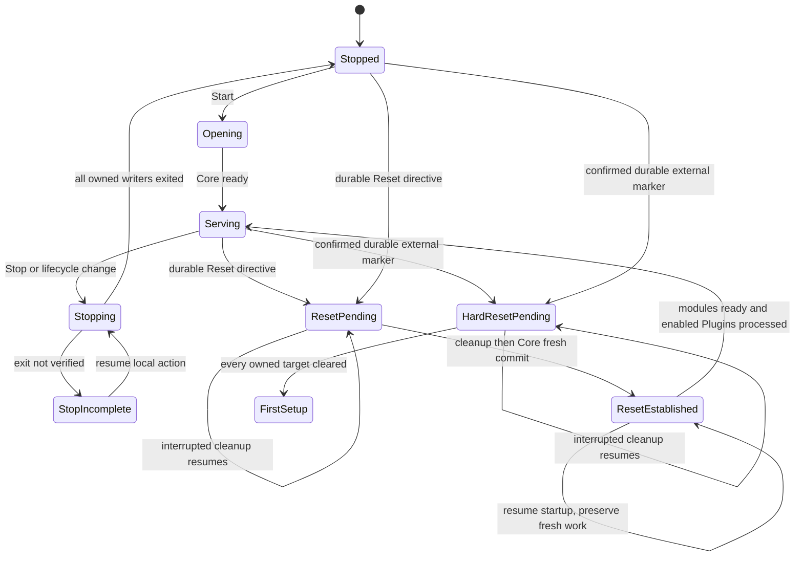

# Dataset lifecycle

This page owns the Start, Stop, Restart, Reset and Hard Reset actions and their effects: what operational state and Installation setup each keeps, diagnostic log retention, Dataset identity and the Dataset boundary, Reset execution and recovery, unfinished work after Stop or Restart, release mismatch and release updates, Core runtime lifetime, Hard Reset, the Mission boundary and the lifecycle exclusions.

Topic-specific retention follows each topic page: [Tasks](tasks.md#terminal-outcomes-and-retention), [Objects](objects.md), [Operations](plugins.md#retained-effects-and-outputs), [Plugin private storage](plugins.md#restart-and-reset), [Asset report acceptance](asset-reporting.md), [Entity ID reservation](tracks-and-geofeatures.md#entity-id-reservation) and [retained Asset identity](identity-and-access.md#retained-asset-identity-after-reset). The module opening interface, the lifetime grouping of Core's tables and the shared host-side management module are in the system design under [Opening a Dataset](../architecture/system-design.md#opening-a-dataset), [Write commits](../architecture/system-design.md#write-commits) and [Local lifecycle coordination](../architecture/system-design.md#local-lifecycle-coordination).

## Lifecycle actions

| Action | Runtime effect | Operational data and logs | Installation setup |
| --- | --- | --- | --- |
| Start | Start Core using existing state, then start compatible enabled Plugins; initialize an empty store on first use | Preserve existing state | Preserve and reapply |
| Stop | Stop Core and all managed Plugins | Preserve | Preserve |
| Restart | Stop Core and all managed Plugins, then start Core and compatible enabled Plugins | Preserve | Preserve and reapply |
| Reset | Stop Core and all managed Plugins, clear Atlas-owned operational state and Atlas-managed diagnostic logs, then start Core and compatible enabled Plugins | Wipe | Preserve and reapply |
| Hard Reset | Stop Core and managed Plugins, clear all Atlas-managed state, then enter first-time setup | Wipe | Wipe profiles, credentials, settings and Plugin installations; retain Core software |

Restart and Reset are primarily development actions. Reset is the usual way to begin fresh; Restart preserves data and diagnostic logs for further development and inspection.

Retention is bounded by Reset rather than the Core process lifetime. If Core is already stopped, Reset still ensures managed Plugins are stopped before clearing state, then starts Core and compatible enabled Plugins.

## Operational state and installation setup

Operational state includes Entities and Tracks, Tasks, Object metadata and content, movement and activity history, Plugin Operation records, synchronization records, Task creation identities, Asset registration retry records, Entity identity reservations and deletion markers, Asset report acceptance state, required-result declarations and successful upload identity records with any deletion markers. It also includes each Plugin's Atlas-managed working directory under [private operational storage](plugins.md#private-operational-storage).

Private Dataset metadata retains the Dataset ID and writing Core release across same-release Restart and is re-established by Reset. Temporary upload files are disposable staging, cleaned after interruption or on startup under [Uploads](objects.md#uploads).

Installation setup survives Start, Stop, Restart and ordinary Reset. It includes Operator profiles and personal settings, installed Plugin selections, credentials and their creation retry records, configuration, installed software and Plugin artifacts. Profiles belong to retained installation setup; Reset clears activity history but not those profiles. Asset ID bindings, Open enrollment provenance, credentials and revocations are also installation setup under [retained Asset identity](identity-and-access.md#retained-asset-identity-after-reset), and installed Plugin reference data stays outside the working directory as [installation setup](plugins.md#private-operational-storage). [Hard Reset](#hard-reset) additionally clears installation setup.

## Diagnostic logs

Start, Stop and Restart preserve Atlas-managed diagnostic logs. Reset clears them as well as operational activity history, including any logs managed through Docker; merely restarting a container is not Reset. Reset does not erase unrelated host logs or files. Hard Reset clears all Atlas-managed logs. Local actions taken while Core is stopped follow the [local activity journal](history.md#local-actions).

## Dataset identity and the Dataset boundary

Each Dataset has an identifier, created on first initialization, retained across Restart, and changed by Reset before new state is exposed, including release-update Reset.

Core rejects old-Dataset mutations and work submissions, including resource writes, Task instructions and reports, Plugin Operation submissions and upload submissions and publication. It also rejects replay requests with obsolete Dataset cursors and upload retries with obsolete Dataset identities. The shared [write commit](../architecture/system-design.md#write-commits) enforces this rejection once for every public Dataset-bound write.

Health, authentication and current-Dataset discovery remain available without an old-Dataset match, so a client can reconnect and read a fresh snapshot. Ordinary reads do not authorize replaying old writes.

Dataset identity does not identify an Asset process, introduce a Session resource, or promise Reset during an active Mission. The SDK's detection of a changed Dataset and its discarding of old pictures and pending submissions follow [SDK Dataset Reset handling](sdk.md#dataset-reset-handling).

## Dataset wire boundary

Public HTTP operational requests carry `Atlas-Dataset-ID`, and responses carry the same header plus the `dataset_id` in their [Protocol envelope](../architecture/system-design.md#public-wire-conventions). Missing required identity is `400 dataset_required`; a different current identity is `409 dataset_mismatch` with the current nonsecret ID and no mutation. Core rechecks this inside the write commit, after authentication and before retry claims or effects. It checks Dataset-bound reads and pagination too, so delayed reads cannot cross a Reset unnoticed. The check covers installation-scoped public credential/configuration writes as well as Dataset records. Installation retention never authorizes replaying an old public request.

Authenticated `GET /health` discovers `dataset_id`, Core release, supported Protocol editions and Core time without a Dataset match. Health/authentication and documentation negotiation remain outside the old-Dataset gate. A feed authenticates its Dataset and selected Protocol edition before delivering data; Reset closes old subscriptions rather than reusing them for the new Dataset. Cursor tokens bind their Dataset and never translate between them. The SDK's corresponding rules are [connection setup](sdk.md#connection-setup) and [Reset handling](sdk.md#dataset-reset-handling).

## Host supervision and private coordination

The initial deployment profile is Linux with systemd and Docker Compose. One installation-specific `atlas-manager@<installation_id>` host service runs the shared local management implementation. It is supervised with restart-on-failure and remains active after CLI/TUI exit, including while Core is stopped. This deliberate service choice gives runtime-loss detection and interrupted-cleanup recovery one owner; it adds no public service or second Core database client. Core and Plugin containers use Compose `restart: "no"`; restarting the manager never automatically restarts Core or a faulted Plugin.

CLI and TUI connect to `/run/atlas/<installation_id>/manager.sock`. The socket accepts only the installation owner or configured local management group, checked using Unix peer credentials; requests carry no public API key. The manager talks to Core through a separate owner-only Unix socket mounted into Core. Private requests include action identity and the current Core-run identity. The manager verifies the exact expected container/image and Core handshake; Core verifies the management peer and rejects stale-run controls. Core's maintenance mode exposes only this private boundary before operational serving and is the sole reader/writer of SQLite during stopped-state inspection, format validation and setup. Host tooling never opens the database itself.

One exclusive installation management lock serializes Core lifecycle, setup, configuration application and Plugin lifecycle actions. A public Core settings patch obtains a short private management reservation before its Core transaction; no filesystem/control work happens inside SQLite. Two local invocations either join the same submitted action ID or receive `management_busy` with the active action ID. Plugin policy stays in Core while it runs. The manager applies targeted Compose actions with `--no-deps`, not project-wide replacement that could restart unrelated services.

During a Core run, the manager watches Docker container events and a one-second private liveness exchange. Three missed exchanges or an exited Core container disables new Plugin starts and stops its managed Plugins. Plugins also receive a short-lived Core-run lease over their private channel and stop initiating new work if it expires. The manager verifies container exit after a ten-second termination grace and kills a still-running managed container after unexpected Core loss. It reports incomplete cleanup if Docker cannot confirm exit; no Task or Operation success is inferred. A manager restart first inspects owned containers and resumes gates/actions before accepting new lifecycle work. Orphaned Plugin containers are stopped when their Core run cannot be verified. Service stop/host shutdown also stops owned containers. This is eventual lifetime enforcement, not instantaneous failure detection or Mission recovery.

For a planned independent Plugin stop, the manager obeys Core's [protected stopping](plugins.md#protecting-active-work): it reports waiting if finite work is not drained and does not silently force it after a timer. Explicit force stop is a separate confirmed local action. Whole-installation Stop/Restart/Reset can classify unfinished Core-owned work under the existing lifecycle rules rather than wait for successful completion.

### Owned storage and durable actions

The default layout is one `/var/lib/atlas/<installation_id>` root with `core/core.sqlite`, `objects`, `staging`, `logs`, `setup`, and `plugins/<plugin_id>/{work,setup,reference,artifacts}`. Core alone receives its database/Object mounts. A Plugin receives writable `/var/lib/atlas-plugin/work`, read-only reference/artifacts, private settings/credential files and its own runtime socket directory; it receives no other Plugin's mount or Docker socket. In-container paths are stable even if host deployment paths change.

The manager's recovery authority is outside that root at `/var/lib/atlas-manager/<installation_id>/actions`. Its JSON action record uses `record_format=1`, UUID `action_id`, `kind`, installation/target identity, action-specific `phase`, intended Core release/digest, optional Reset identity, completed cleanup targets and safe outcome/error. Write a same-directory temporary file, sync it, atomically rename it and sync the directory before performing the newly recorded phase. Destructive actions first sync their startup-blocking marker. In-memory acknowledgement or diagnostic logging is not durable authority. Core state changes are queried through its private interface after every uncertain response; a lost response never authorizes repeating a fresh opening blindly.

Every resource has installation ownership recorded by the manager: exact root-relative paths, Compose project labels and container IDs. Cleanup rejects paths outside the installation root, symlinks escaping it and conflicting ownership. It stops and verifies every relevant writer first, then removes whole owned targets without parsing Plugin files. Docker log cleanup removes/recreates stopped owned containers or removes their owned logging resources through Docker; the manager does not truncate daemon-private log files. Core preserves its database mount across ordinary Reset. Shared images/networks and unrelated containers are not pruned. A required target is complete only after absence or the expected empty owned directory is verified and synced; permission/storage failure stays incomplete.

Reset's directive and local activity journal retain their existing separate roles. Hard Reset retains only its external progress marker until required cleanup succeeds; it then removes that marker and enters fresh local setup. No old action archive is imported into the fresh installation.

### Recovery states

Ordinary serving stays disabled while cleanup is pending. StopIncomplete does not claim that all Plugins stopped; Start resumes/finishes that stopping action before opening. An established Reset is a distinct state even if compatible Plugin startup failed. Its next Start uses retained opening and repairs startup gates without clearing new work. A Plugin failing startup is faulted; retrying the coordinator finishes accounting for that failure without rerunning an Operation or repeatedly restarting the Plugin. A later explicit Plugin start/recovery action is separate.

These mechanisms use [systemd service supervision](https://github.com/systemd/systemd/blob/main/man/systemd.service.xml), [Compose service lifecycle settings](https://docs.docker.com/reference/compose-file/services/#restart) and local Unix authentication. Their Atlas-specific recovery behavior still needs the real-host scenarios below.

## Reset execution

Reset is Start with a fresh Dataset. An interruption at any point completes the Reset without serving a partially cleared Dataset or clearing it twice.

1. The host coordinator records a fresh-Dataset directive with a Reset identity on the installation mount before stopping anything.
2. It stops managed Plugins and Core.
3. With Core and all managed Plugin writers stopped, host management clears Atlas-managed diagnostic logs, the pending local activity journal and this installation's Plugin work directories. Plugin cleanup is made durable before the fresh-opening transaction can record the Reset identity; filesystem removal and the SQLite commit are separate operations.
4. Core opens every module fresh: one SQLite transaction clears all Dataset tables, establishes the new Dataset ID and records the Reset identity in Dataset metadata. Objects then removes, by ownership, content belonging to any Dataset other than the new one, so an interrupted and retried Reset cannot leave earlier content behind.
5. Core serves operational requests after every module is ready.
6. The host removes the directive only after compatible enabled Plugins have started.

The coordinator does not clear module tables itself. Each module's fresh opening follows [Opening a Dataset](../architecture/system-design.md#opening-a-dataset).

### Interrupted Reset

If Plugin work-directory cleanup fails or is interrupted, the directive is retained and Reset is reported incomplete. The fresh Dataset is not established and no Plugin work starts until cleanup succeeds. The next Start resumes that cleanup while writers remain stopped.

If the next Start finds a directive whose Reset identity is not recorded, the host completes pending cleanup before Core opens fresh. Before establishment, repeated cleanup is safe because no Plugin has started new-Dataset work.

Once Core records the Reset identity, the directive is established. If the next Start finds a directive whose Reset identity is recorded, Core opens retained so post-Reset data survives, and the host completes Plugin startup without clearing the Plugin work directories again. This preserves work created by Plugins that already started in the new Dataset, even if management was interrupted before starting the remaining Plugins or removing the directive. The host uses Core's private coordination for the establishment decision, preserving Core's exclusive access to its SQLite database.

## Unfinished work after Stop or Restart

Retention preserves evidence; it does not claim that execution continued. Stop records interrupted Core-owned work when possible. Before serving retained state on Start, Core classifies any remaining unfinished Tasks, Operations and uploads from the previous Core run through each module's [retained opening](../architecture/system-design.md#opening-a-dataset). Preserve confirmed terminal outcomes first.

| Retained work | Behavior after Start |
| --- | --- |
| Asset Tasks | Keep recorded statuses, reports and result references. Do not infer Asset success, failure or cancellation from the Core interruption, and do not automatically reissue Tasks. See [Tasks](tasks.md#terminal-outcomes-and-retention) |
| Plugin Operations | Mark unfinished Operations Interrupted under the [Operation lifecycle](plugins.md#operation-transitions). A submission retry retrieves that Operation; a rerun must be explicit |
| Partial Object uploads | Clean up abandoned private staging. Retried uploads start from the beginning; no partial-transfer resume or inspection store is required. Preserve already-published Objects and successful upload identity records. See [Uploads](objects.md#uploads) |

Retained records do not authorize automatic resumption or rerun. A Plugin crash while Core remains running follows [Plugin faults](plugins.md#faults); Asset execution remains the Asset OS's responsibility.

This classification supports retained development records, not active Mission recovery or a promise to drain all work before Stop. Whole-Core interruption does not add a Task status. Reset clears these records with the rest of operational state.

## Release mismatch and release updates

Core stores the writing Core release with the Dataset. Ordinary Start checks it before serving operational data. A mismatch refuses startup with a clear instruction to use the explicit update and Reset flow; it never silently wipes, migrates or reinterprets retained data. First initialization and Reset establish a Dataset for the running release. Same-release restarts retain state.

A new-release update includes Reset. After an update, installed Plugin compatibility and retained configuration are checked under [Releases and compatibility](plugins.md#releases-and-compatibility). This release check is separate from [compatible client versions](../adr/0005-allow-compatible-client-versions.md).

## Retained formats and explicit release update

This is the implementation specification for [#67](https://github.com/atlas-field-systems/atlas-core/issues/67). Dataset migration remains excluded; retained installation-format evolution is a separate, explicit update step.

Core owns a stable bootstrap metadata record with `installation_format`, `dataset_format`, each schema fingerprint, writing Core release, Dataset ID and last established Reset identity. Each Core artifact declares the formats/fingerprints it can open and a finite registry of reviewed installation-only conversions. The initial formats are 1. Fingerprints cover the module-owned schema declarations and detect changed persisted layouts even when the development release number was not changed. The host does not inspect SQLite to obtain them.

Ordinary Start requires an exact writing Core release and compatible recorded formats/fingerprints. Same-release schema drift is an explicit `schema_drift` failure; Reset may replace Dataset-only drift, while installation drift requires a reviewed converter or the release matching that format. A higher release with identical schemas still requires the explicit update/Reset flow. No ordinary opening silently upgrades a schema, clears incompatible tables or converts settings.

A local `update` action names the new Core image digest and confirms its Reset effect. With owned writers stopped, the target Core runs private validation/maintenance mode. It reads the stable bootstrap record, validates the retained profiles, identity bindings, denials, credential verifiers/creation claims and candidate Core settings, and determines whether every installation-format transition has a supplied converter. Installed Plugins are checked too; incompatibility retains the Plugin installed but disabled with a reason. Invalid Core settings or an unsupported retained format refuses the update before operational cleanup/establishment. Local management can edit a failed candidate or choose a release that supports the retained format while serving remains disabled. Hard Reset is an explicit destructive alternative, never an automatic repair.

After successful preflight, the manager records its target image and Reset directive, performs the ordinary stopped-writer cleanup, then asks the target Core to establish fresh. One SQLite transaction applies the named installation-only converters, replaces Dataset tables from the target release's module schema manifest, establishes the target formats/fingerprints and new Dataset/Reset identity. It keeps permanent Operator/Asset IDs, credential identity/verifiers, creation claims and revoked/retired denial facts unchanged. A converter cannot relabel a retired Asset, revive a revoked credential, change a publisher's authority or reinterpret incompatible configuration. It may change private representation while preserving those facts. The new Core performs ordinary module readiness and Object ownership cleanup before serving.

A transaction interrupted before commit rolls back both the installation conversion and fresh Dataset. The durable directive names the same target image, so the next Start validates and retries that transition; it cannot start an old binary against half-converted state. After commit, the Core-established Reset identity is proof to open retained and finish startup without repeating cleanup or conversion. The manager removes the directive only after startup is accounted for. Repairing an invalid setting uses a versioned local settings action, not a database edit. Operational-data rollback, import and backup/restore remain outside this update mechanism.

| Existing state and requested action | Selected behavior |
| --- | --- |
| Same release, matching formats/fingerprints; Start/Restart | Open retained; no schema conversion |
| Same release, Dataset schema drift | Refuse ordinary Start; explicit Reset replaces Dataset schema while preserving valid installation format |
| Same release, installation schema drift | Refuse; use compatible binary or supplied explicit installation conversion; Reset alone cannot erase setup |
| New release, supported installation format and any old Dataset schema | Preflight then explicit update/Reset; replace operational schema, retain identities/profiles/denials |
| New release requires installation format 2 and includes converter 1→2 | Execute that converter only during explicit fresh transaction; ordinary Start still refuses release mismatch |
| Unknown installation format or unsupported Core setting | Serving disabled with actionable field/format error; correct through local management or use a compatible release |
| Interrupted before fresh transaction commits | Directive remains unestablished; retry cleanup/open with target image |
| Interrupted after establishment, Plugin already produced new work | Retained open; no conversion or work-directory cleanup repeated |

## Core configuration

This page owns the Core settings contract for [#80](https://github.com/atlas-field-systems/atlas-core/issues/80). `GET /admin/config` returns public desired settings, their decimal-string `config_revision`, active settings/revision, `pending_fields` and the last safe apply/startup error. TLS keys, credential/enrollment secrets, verifier material, Docker controls and the installation/database root are never public fields.

| Public field | Validation | Apply timing |
| --- | --- | --- |
| `request_body_limit_bytes` | Positive integer within the supported 64 KiB..4 MiB range; applies to ordinary JSON, not streaming file content | Live, new requests |
| `max_concurrent_uploads` | Integer 1..32 | Live, new admission; current accepted transfers retain their slot |
| `max_inflight_operations_per_plugin` | Integer 1..1,024 | Live, new acceptance; never cancels already accepted work |
| `object_quota_bytes`, `object_free_space_reserve_bytes` | Positive byte counts; quota must fit capacity after reserve, and cannot be lower than published bytes plus accepted reservations | Live, new upload reservation; preserve existing Objects |
| `contact_degraded_after_ms`, `contact_offline_after_ms` | Positive integer adequate-IP default durations, degraded less than offline | Live recomputation of Communication state; no fabricated fresh Contact |
| `contact_link_expectations` | Overrides keyed by declared Protocol capacity class, each containing positive `freshness_ms`, `degraded_after_ms` and `offline_after_ms`, with degraded less than offline | Live, future contact proofs and state derivation for that link class |
| `replay_max_bytes`, `replay_max_age_ms` | Positive bounds; minimum bytes at least one allowed maximum-size commit | Live, prune whole oldest commit batches and advance recoverable boundary |
| `listen_address`, `listen_port` | Valid local IP bind address and port 1..65,535 | Explicit local Restart between Missions |
| `allowed_origins` | Unique exact HTTPS origins; no wildcard with credentials; empty allows same-origin only | Explicit local Restart between Missions |
| `object_storage_path`, `diagnostic_log_path` | Absolute owned paths, disjoint from database/setup and each other; no escaping symlinks | Explicit local apply while stopped, then Start between Missions |

Setup stores explicit initial values: ordinary JSON requests 1,048,576 bytes, four concurrent uploads, 16 in-flight Operations per Plugin, Object quota 16,000,000,000 bytes with 8,000,000,000 bytes free-space reserve, adequate-IP Contact degradation after 3,000 ms and offline after 10,000 ms, with no per-link overrides until explicitly configured, and replay up to 64 MiB or fifteen minutes, whichever bound is reached first. For relayed Assets the link class describes Asset-to-gateway communication, never the gateway's IP connection to Core. Link-specific freshness uses [contact proof](asset-reporting.md#contact-proof-and-clock-uncertainty); default IP challenge freshness is separate from degradation thresholds. Address/path/origin values come from local setup. Retained settings are not reinterpreted when release defaults change. These starting bounds require measurement and tuning; four concurrent uploads is the normal field profile. The [provisional workload](../architecture/operating-model.md#expected-workload) is a measurement target, not the quota, maximum Object size or a latency guarantee. The Object contract owns upload-size rules; this table does not silently add a universal Task/Operation timeout.

A patch carries the reviewed desired `If-Match` ETag. Core validates the entire merged candidate, including cross-field capacity/path rules, before changing anything. Unknown keys, null mandatory values or invalid combinations reject without a revision, activity or partial application. A stale reviewed revision is `412 version_conflict`; missing precondition is `428 precondition_required`. On acceptance Core commits one immutable desired revision and attributed activity with a management reservation. It then publishes the prevalidated live settings to the running process before confirming the response. Active settings can combine those live values with old deferred fields, so `active_revision` identifies the actual immutable effective snapshot separately from desired. Changing active/deferred status does not increment the desired edit ETag. Lower live limits refuse new work and do not cancel work already admitted.

Deferred changes return success with their `pending_fields` and `apply_required=true`. Public success confirms saved intent, not process restart. Local apply/start validates TLS binding, filesystem ownership/capacity and candidate format before serving. A changed Object path must point to the same owned retained store with matching Dataset identity, or accompany an explicitly requested Reset into an empty owned store. Atlas does not silently lose retained content, adopt another installation's store or move data on a configuration patch. Path preparation/rebinding is a local deployment task. Failed startup keeps serving disabled and preserves failed desired settings plus last startup-validated revision. The local operator explicitly selects that revision or corrects settings while Core is stopped, then Starts again. There is no automatic fallback or hidden setting conversion.

## Offline TLS and first-time setup

This closes deployment setup [#79](https://github.com/atlas-field-systems/atlas-core/issues/79). The supported public connection is direct HTTPS/WSS to Core on a configured stable local hostname or IP address. Its certificate includes every supported address in Subject Alternative Name. A router/local hosts entry can provide the name; internet DNS, public certificate issuance and NTP are not prerequisites. HTTP credential traffic and untrusted-certificate bypass are unsupported.

Local first-time setup, authenticated by the Unix management peer, proceeds while operational serving is disabled:

1. Choose the installation identity, owned directories, local HTTPS address and exact browser origins. Load Core and Plugin images/reference data before going offline.
2. Generate an installation-local CA and server certificate, or install administrator-supplied trusted certificate/key material. Store CA private key and server key in owner-only installation setup; Core mounts only the server material it needs. Certificate replacement is an explicit local between-Missions action.
3. Export the nonsecret CA certificate and verify its fingerprint through the local management channel. Install it in the operator browser/OS trust store or supply it to Node SDK HTTPS/WSS transport. Check hostname/SAN and validity normally. The public address is not discovered by sending a credential to an arbitrary network host.
4. Prepare and securely retain the first administrative API key locally using the [credential creation contract](identity-and-access.md#api-keys). Maintenance Core accepts that prepared key through its authenticated private socket and stores a verifier. No secret appears in command arguments, action/history logs, public status or a one-time server response. Local enrollment authorization and Plugin runtime credentials are provisioned through their own identity contracts.
5. Start Core, authenticate health discovery with the retained credential, negotiate Protocol/Dataset and connect the authenticated feed. No cloud login or browser-session service is added.

For protected browser documentation, an unauthenticated `/docs` response may show only a minimal key-entry shell and `401`; it contains no schema or protected documentation. The entered key remains in page memory and authorizes HTTPS fetches for the renderer/schema. It is never a URL parameter, localStorage value or server session. Closing the page discards it. The operator obtains/recovers keys through the local setup path; key entry alone cannot bootstrap installation authority.

Start/Restart and ordinary Reset retain CA/trust material, authorization and server configuration. Reset changes Dataset while the same valid credential can rediscover it. Hard Reset removes owned CA keys, certificates and authorization; fresh setup creates new material. External clients may still trust the old CA but old credentials/Dataset cannot authorize the replacement installation. Client trust removal and externally copied data remain local client responsibilities.

The Node transport uses normal [CA and hostname verification](https://nodejs.org/api/tls.html); browsers use their trust store for both HTTPS and [WebSocket connections](https://websockets.spec.whatwg.org/). The exact CA is an installation choice, and tests must exercise trust failures without disabling verification.

## Lifecycle and setup fixtures

The following are independent expected scenarios for [#67](https://github.com/atlas-field-systems/atlas-core/issues/67), [#68](https://github.com/atlas-field-systems/atlas-core/issues/68), [#79](https://github.com/atlas-field-systems/atlas-core/issues/79) and [#80](https://github.com/atlas-field-systems/atlas-core/issues/80), not executed test results. Use real local management, SQLite, filesystem and Docker containers; observe outcomes through the same interfaces as CLI/TUI and SDK.

| Scheduled event | Expected observable result |
| --- | --- |
| CLI exits; Core container crashes while Plugin runs | Host service detects loss, stops/inspects owned Plugin; uncertainty retained; no automatic Core/Plugin restart |
| Two management calls and a public config patch race | One exclusive action/reservation order; others get busy or serialize; no concurrent cleanup/write |
| Stop cannot verify Plugin exit | Stop incomplete; startup/cleanup blocked until confirmed; no fabricated completion |
| Reset interrupted before/partway through cleanup or before fresh commit | Unestablished directive persists; no serving/new Plugin work; next Start resumes cleanup |
| Reset interrupted after fresh commit and one Plugin creates new work | Establishment queried through Core; retained open preserves new work and settings; no second cleanup |
| Compatible enabled Plugin fails ready handshake during Reset startup | Dataset stays established; Plugin fault visible; remaining startup accounted for; explicit recovery, no rerun |
| Hard Reset interrupted after Core exits, unrelated containers/files present | External marker blocks ordinary Start; resume clears only owned targets; unrelated resources/Core software survive |
| New release replaces incompatible Dataset schema with valid setup | Explicit preflight/update retains Operator IDs, Asset bindings, retired denials, revoked verifiers and API-key creation identities |
| Unsupported retained format or invalid desired settings at update/start | Refusal before fresh establishment; actionable safe error; local versioned repair while stopped |
| Same-release development schema fingerprint changes | Ordinary Start refuses drift; Dataset Reset or reviewed installation converter follows the table |
| Offline first setup with correct CA/name/key | Authenticated HTTPS health and WSS feed work with internet disabled |
| Untrusted CA, wrong hostname or expired certificate | Explicit trust failure; no plaintext fallback or credentials in diagnostics |
| Expired/revoked credential and authenticated reconnect | Authorization failure; no feed payload after revocation; replacement authority required |
| Reset, then delayed old-Dataset request and health discovery | Old request rejected; retained credential discovers new Dataset; no relabelled submission |
| Hard Reset, fresh setup, old credential/feed reconnect | Old authority and Dataset rejected; fresh setup required |
| Desired revision 5 patched twice from reviewed 5 | One revision 6 commits; other conflicts without partial update/activity |
| Concurrent-upload limit reduced from 4 to 2 while 4 admitted uploads run | Patch accepted; the 4 finish; new uploads refused until active count is below 2; no cancellation |
| Quota reduced below published bytes plus accepted reservations | Candidate rejects atomically; no revision, deletion or partial limit change |
| Deferred binding/path edit then startup fails | Saved revision remains pending/failed; serving disabled; explicit local restore/correction reopens, without automatic fallback |

## Runtime lifetime

Managed Plugins operate only while Core is running. Their stopping with Core, independent lifecycle while Core stays running, incomplete shutdown and unexpected Core loss follow [Runtime lifetime with Core](plugins.md#runtime-lifetime-with-core).

## Hard Reset

Hard Reset is a distinct action in the local CLI/TUI that can be invoked while Atlas is running or while it is stopped. It removes all Atlas-managed state and returns the installation to first-time setup. It has no public HTTP endpoint or SDK operation. Ordinary Reset continues to preserve installation setup and Operator profiles.

### Scope

Hard Reset clears the Dataset and its protected Task results, Object content and staging, all histories and logs, all retry and identity records, Operator profiles and personal settings, administrative, Asset, Plugin and gateway credentials, enrollment authorization material, Core and Plugin configuration, installed Plugin selections, managed Plugin containers, private Plugin data and downloaded Plugin artifacts. It clears Atlas-managed Docker logs and storage too.

Cleanup is scoped to this Atlas installation's owned resources; it does not prune unrelated containers, shared images, host files or external services. The Core executable or container image and the local management tool remain so Atlas can run first-time setup again. Copies already downloaded to external clients are outside this local action.

### Confirmation and stopping

The CLI/TUI identifies the target installation and requires an explicit destructive-action confirmation. Once confirmed, a local coordinator stops accepting requests, closes live connections, disables automatic container restart and stops Core and managed Plugin writers before cleanup. Hard Reset deliberately discards their unfinished work rather than waiting for successful Task or Operation completion. It does not send a stop command to physical Assets or guarantee their behavior; field use still requires the operator to manage those Assets separately.

### Coordinator and failures

The coordinator must remain able to finish cleanup after Core stops, and runs on the host under [Local lifecycle coordination](../architecture/system-design.md#local-lifecycle-coordination). It is serialized against other lifecycle and configuration actions. It records that cleanup is in progress outside the data being removed, and blocks ordinary startup until it finishes.

On failure or coordinator interruption, serving stays disabled and the incomplete cleanup is reported; rerunning or resuming the local action completes the remaining cleanup. Hard Reset does not claim success while any required target remains uncleared. The progress marker is removed after successful cleanup; Atlas retains no pre-reset activity or log archive.

### After cleanup

Hard Reset returns to local first-time setup without automatically restoring old settings, Plugins or credentials. Fresh setup authorization and a new Dataset are provisioned before operational service is enabled. Old credentials, connections, Dataset submissions and retry records cannot authorize or repopulate the fresh installation. Operator profiles start empty.

## Missions

Core remains available throughout a Mission. Restart, Reset and release updates happen outside Missions, with Assets no longer participating. The [field workflow](../architecture/operating-model.md#field-workflow) describes the surrounding operating assumptions.

Active Mission continuity across a whole-Core restart is excluded. Atlas does not require reattachment of executing Assets, resumption of Plugin Operations or continuation of uploads after Core restarts. An unexpected Core failure is outside that continuity guarantee; this assumption does not require fault tolerance or automatic recovery.

## Exclusions

Backup and restore functionality and version-to-version operational-data migrations are excluded. Persistent storage uses the [selected stack](../adr/0016-use-go-sqlite-and-openapi-tooling.md) and [Docker mount layout](../adr/0017-deploy-core-and-plugins-as-docker-containers.md#storage-and-scope).

## Routes and local actions

- Start, Stop, Restart, Reset and Hard Reset are local CLI/TUI actions through the shared management implementation under [Local administration](../architecture/system-design.md#local-administration). They have no public endpoint or SDK lifecycle method.
- `GET /health` in [Health and documentation](../api-endpoints.md#health-and-documentation), authentication and current-Dataset discovery remain available across a Dataset change.
- The SDK handles a Dataset change under [SDK Dataset Reset handling](sdk.md#dataset-reset-handling).

## Open questions

- Distribution of signed release bundles and supported installer packaging beyond the selected Linux/systemd/Docker profile.
- Additional host platforms require their own lifetime-enforcement evidence.

## Decisions

- [ADR-0015](../adr/0015-separate-start-stop-restart-and-reset.md): separate Start, Stop, Restart, Reset and Hard Reset, with retention bounded by Reset, Dataset identity, release-update Reset and no whole-Core Mission continuity.
- [ADR-0021](../adr/0021-manage-plugin-operational-storage-through-reset.md): Reset clears Plugin working directories before the fresh Dataset is established.
- [ADR-0017](../adr/0017-deploy-core-and-plugins-as-docker-containers.md): mounted storage separated by lifetime and a host-side coordinator for Reset and Hard Reset.
- [ADR-0005](../adr/0005-allow-compatible-client-versions.md): compatibility checks after an update, separate from the writing-release check.
- [ADR-0013](../adr/0013-start-each-core-run-with-empty-data.md) and [ADR-0003](../adr/0003-retain-durable-activity-history.md): superseded by ADR-0015.

## Test evidence

These rows of the [required scenario coverage](../testing-strategy.md#required-scenario-coverage) apply:

- Reset and Restart: old-Dataset rejection in every mode, retained records after Restart, writing-release mismatch refusal and interrupted Operations without automatic rerun.
- Hard Reset and retained setup: setup kept by ordinary Reset, Hard Reset while Core and Plugins run, and interrupted cleanup that blocks startup until resumed.
- Plugin operational storage: Reset cleanup, cleanup failure and recovery.

[Fault and bandwidth testing](../testing-strategy.md#fault-and-bandwidth-testing) adds Dataset opening: crash-then-open recovery per module and Reset interrupted at each step, completed by the next Start without leaving earlier content or clearing post-Reset data. The [MVP integration checks](../testing-strategy.md#mvp-integration-checks) exercise Stop/Start and Restart, and Reset.
